# Mixroom DAW User Manual

English draft  
Recommended source format: Markdown  
Recommended delivery formats: PDF for sharing, DOCX for review/editing

## 1. Purpose

This document explains the main technical functions available in the Mixroom DAW audio editor. It is written as a product/user manual, not an engineering document.

It covers:

- navigation and project controls
- transport, recording, and playback
- timeline tools and clip editing
- rows, mixer controls, effects, and automation
- sample browsing and import/export
- MIDI and piano roll editing
- AI chat capabilities, supported actions, and limitations

## 2. Format Recommendation

Use this Markdown file as the master copy.

For internal review, export it to DOCX so comments and edits are easy. For customers, partners, support, or onboarding, export it to PDF.

Suggested final package:

- `Mixroom_DAW_User_Manual_EN.pdf`
- `Mixroom_DAW_User_Manual_EN.docx`
- this Markdown file as the source of truth

This draft includes Android screenshots from the current running build. Add desktop screenshots later if the desktop layout needs separate coverage.

Included visuals:

- full DAW screen with labeled zones
- selected clip popover
- row effects panel
- automation editor
- add menu
- project settings
- tempo/stretch panel
- master bus
- AI chat
- export sheet

Recommended remaining visuals before customer-facing release:

- piano roll with notes selected
- sample browser with preview waveform
- desktop plugin manager, if desktop plugin workflows are included in the release

## 3. Main Screen Overview

The DAW is organized around a timeline, with project controls at the top, editing tools around the timeline, and chat/transport controls at the bottom.

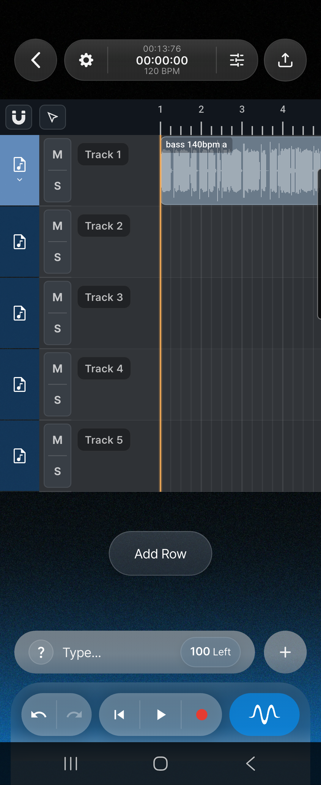

```text
Top toolbar
Back | Project settings | Time / tempo / key | Master bus | Analyzer | Export

Timeline
Rows and mute/solo controls | Audio/MIDI clips | Playhead | Automation lanes

Bottom controls
Add menu | AI chat bar | Undo/redo | Restart | Play/pause | Record | One-Button Mix
```

The main workflow is:

1. Add or record audio/MIDI.
2. Arrange clips on rows.
3. Edit clips, timing, pitch, gain, and tempo behavior.
4. Mix with row controls, effects, automation, and master bus processing.
5. Use AI chat for guidance, edits, or mixing actions.
6. Export the final result.

## 4. Top Toolbar

### Back

Returns from the editor to the previous screen. If the project needs a name before exit, Mixroom asks for it.

### Project Settings

Opens project-level settings:

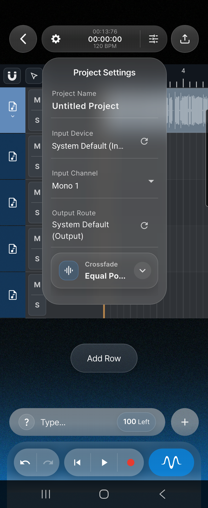

- project name
- input device
- input channel
- output device or output route
- Bluetooth recording policy when relevant
- crossfade mode
- metronome on/off
- metronome volume
- producer capture UI toggle, when enabled
- desktop MIDI keyboard input, on supported desktop builds
- desktop spacebar behavior
- keyboard shortcuts
- desktop plugin manager
- diagnostics
- project recovery notices
- replay interactive DAW tutorial

### Time / Tempo / Key

The center toolbar section shows current time, project length, and BPM. Tapping it opens tempo controls.

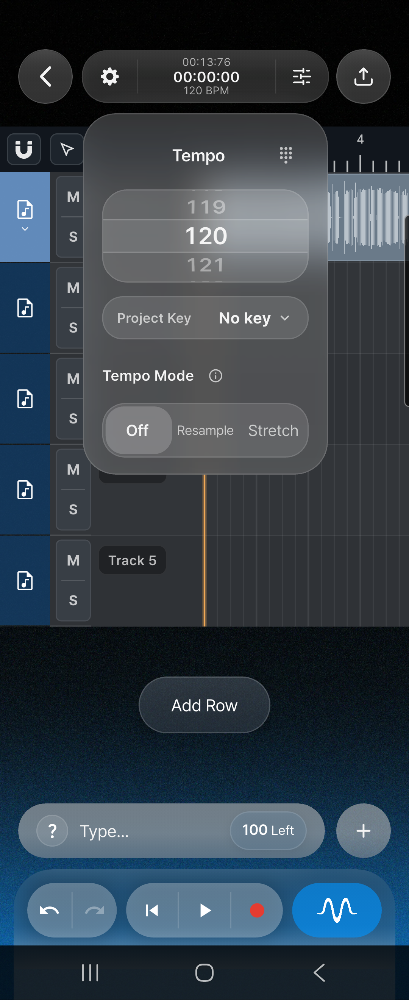

Tempo controls include:

- BPM picker from 20 to 999 BPM
- manual BPM input
- project key selector
- tempo mode: Off, Resample, Stretch

Tempo mode affects how audio clips follow BPM changes:

| Mode | Behavior |
| --- | --- |
| Off | Clips keep their current timing unless edited manually. |
| Resample | Clips follow tempo by changing playback speed, which can affect pitch. |
| Stretch | Clips follow tempo while preserving pitch. |

Project tempo mode sets the project-wide behavior and default. Existing audio clips can still have their own clip tempo mode. If a clip is set to Off, changing the project to Stretch does not make that clip follow tempo until the clip itself is set to Resample or Stretch.

### Master Bus

Opens the master bus panel. This is where users control processing that affects the whole project.

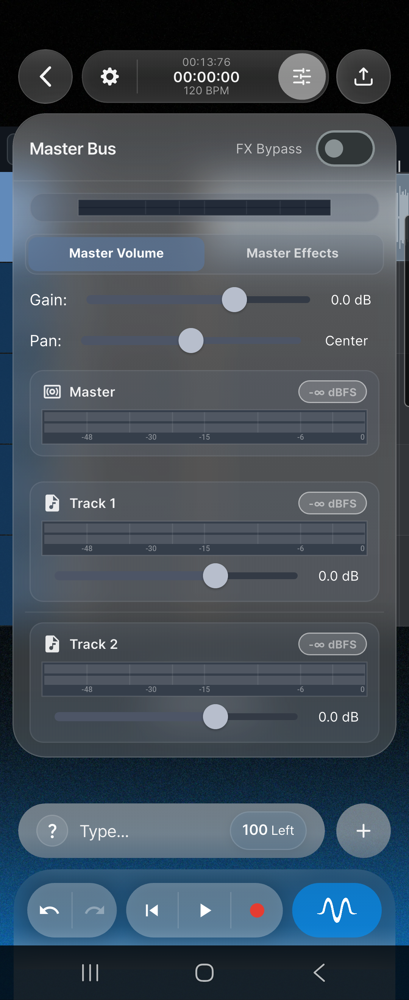

Master bus includes:

- master volume
- master pan
- master level meter
- row-level gain staging readouts
- master effects chain
- global FX bypass

### Desktop Analyzer

On desktop, the toolbar can show a compact master visualizer/analyzer for recent master output.

### Export

Opens the export flow. Users can render the project and then open or share the saved file.

## 5. Transport Controls

The transport controls are available at the bottom of the editor. On desktop, they appear inline beside the chat bar.

| Control | Function |
| --- | --- |
| Undo | Reverts the last supported editor action. |
| Redo | Reapplies an undone action. |
| Restart | Moves playback back to the start, or to the loop start if looping is active. |
| Play/Pause | Starts or pauses playback. |
| Record/Stop | Starts recording on the selected row, or stops the active recording. |
| One-Button Mix | Runs an automatic Mixroom mix pass. |

Recording requires a selected row and an available input device. If input access is not available, Mixroom shows a permission or input warning.

### One-Button Mix

One-Button Mix runs a guided automatic mix pass on the current project. It is intended as a starting point, not a final mastering decision.

It can adjust supported mix controls such as:

- row balance
- gain
- pan
- EQ
- dynamics
- effects
- master processing

After using One-Button Mix, users should play through the project and check vocal level, low-end balance, harshness, and master loudness before exporting.

## 6. Add Menu

The add button opens three main options:

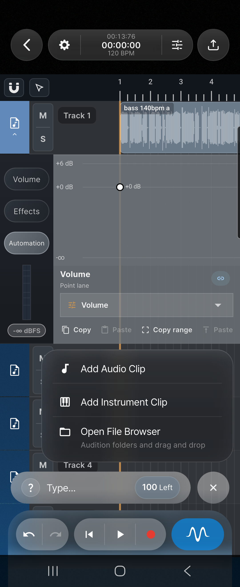

| Button | Function |
| --- | --- |
| Add Audio Clip | Imports an audio file into the timeline. |
| Add Instrument Clip | Creates a MIDI/instrument clip from the instrument picker. |
| Open File Browser | Opens the sample browser for previewing, dragging, and inserting files. |

Audio imports are prepared for project use, including waveform extraction and storage with the project.

## 7. Timeline Tools

The timeline has five main tools.

| Tool | Use |
| --- | --- |
| Select | Default editing tool. Select clips, move clips, trim clip edges, open clip controls, and manage multi-selection. |
| Stretch | Manually time-stretch audio clips by dragging clip edges. Use this when the clip should become longer or shorter on the timeline. |
| Paint | Repeatedly place a copied clip onto the timeline. Useful for drums, loops, repeated FX, or duplicated arrangement blocks. |
| Cut | Split a clip at the chosen timeline point. With snapping enabled, the cut point follows the selected quantize grid. |
| Delete | Delete clips by tapping them or dragging across clips. Useful for quick cleanup. |

### Magnet and Quantize

The magnet button controls timeline snapping.

| Action | Result |
| --- | --- |
| Tap magnet | Turns snapping on or off. |
| Hold magnet | Opens the quantize menu. |
| Choose a quantize value | Sets the grid used by snapping, such as 1/4, 1/8, or 1/16. |

When magnet is on, timeline edits snap to the selected musical grid. This helps clips, cuts, pasted clips, painted clips, loop regions, and automation regions land exactly on beats or subdivisions.

When magnet is off, users can place and edit items freely without grid snapping. This is better for dialogue, sound design, loose performances, or detailed cleanup.

Quantize values are divisions of one bar:

| Value | Meaning |
| --- | --- |
| 1/1 | Whole bar. |
| 1/2 | Half-bar. |
| 1/4 | Quarter-note grid in common 4/4 use. |
| 1/8 | Eighth-note grid. |
| 1/16 | Sixteenth-note grid for tighter edits. |

Practical rule: turn the magnet on for musical arrangement work, and hold the magnet button when the edit grid feels too coarse or too fine.

The timeline also supports:

- horizontal scrolling
- pinch or wheel zoom, depending on device
- playhead scrubbing
- grid display
- clip selection and multi-selection
- loop region display
- waveform and MIDI preview rendering
- automation clip display
- crossfade visualization
- recording overlays

## 8. Rows and Track Controls

Rows are the DAW's track lanes. Each row can hold audio clips, MIDI clips, automation, and row effects.

### Row Header

Each row header includes:

- row icon
- row selection
- expand/collapse
- M mute button
- S solo button
- automation lane collapse/expand indicator when automation is visible

### Row Menu

The row menu supports:

- insert row above
- insert row below
- move row up
- move row down
- rename row
- choose row icon
- delete row

### Add Row

Adds a new empty row to the timeline. If the maximum row count is reached, Mixroom shows a limit message.

## 9. Row Volume

When a row is expanded, the Volume tab provides row-level mixing controls.

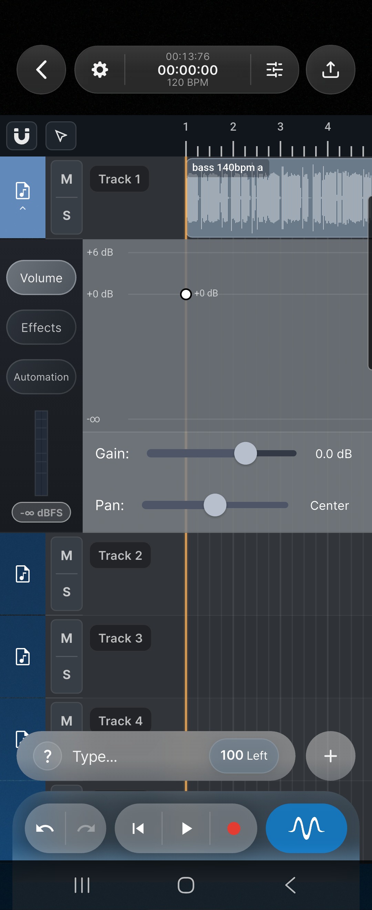

Typical controls include:

- gain
- pan
- stereo meter
- dBFS peak/readout
- reset behavior for gain/pan controls

Use row volume for basic balance before adding effects. Use master volume only for final overall level.

## 10. Clip Editing

Selecting a clip opens a compact action popover.

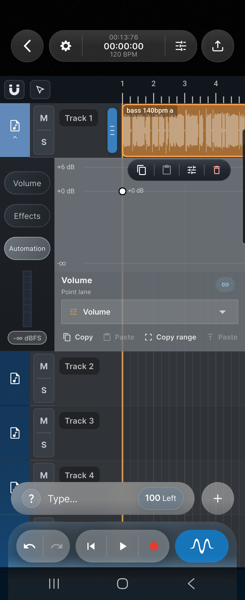

| Clip Popover Button | Function |
| --- | --- |
| Copy | Copies the selected clip or selected clip group. |
| Place clone | Pastes/clones the copied clip near the selection. |
| Clip settings | Opens detailed clip settings. |
| Split at playhead | Splits an audio clip at the current playhead position, when valid. |
| Delete | Removes the selected clip or selected clip group. |

### Clip Settings

Clip settings include:

- rename clip
- clip gain
- normalize
- pitch shift
- tempo mode: Off, Resample, Stretch
- reverse audio
- detect tempo
- split vocals, when stem separation is available

### Tempo Stretching and Clip Stretching

Mixroom has two related but different stretch workflows.

| Workflow | Where | Use When |
| --- | --- | --- |
| Tempo Mode Stretch | Project tempo panel and Clip Settings | A loop or audio clip should follow the project BPM while keeping pitch. |
| Stretch tool | Timeline tool menu | A user wants to manually resize a clip's duration by dragging the clip edge. |

For tempo-following audio, use both the project and clip settings:

1. Open the tempo panel from the top toolbar.
2. Set Tempo Mode to Stretch when clips should follow BPM changes without pitch changes. Use Resample only when pitch-shifting with speed is acceptable.
3. Select the audio clip.
4. Open Clip Settings.
5. Set the clip tempo mode to Stretch.
6. Change project BPM. Clips set to Stretch follow the project tempo and keep pitch. Clips set to Off stay independent.

Project Stretch enables project tempo-follow behavior, but each existing audio clip still needs to be opted in. New imported or AI-created tempo-aware clips may already be configured, but older clips should be checked in Clip Settings.

The Stretch timeline tool is separate. It changes the selected audio clip's length directly. During manual edge stretching, Mixroom enables clip tempo-follow for that clip and uses the stretch engine to fit the new duration.

### Trim, Move, Stretch, and Split

Users can:

- drag clips to a new time
- drag clips to another row
- trim clip starts and ends
- stretch audio clip duration
- split audio at the playhead
- copy and duplicate clips
- delete clips

Multi-selection allows grouped movement and grouped copy/delete actions.

### Loop Regions

Looping repeats a selected timeline range during playback. It is useful for writing parts, checking edits, mixing a section, or practicing automation moves.

On mobile:

- tap the timeline ruler to create a loop region
- drag across the ruler to create a custom loop length
- drag loop handles to adjust the start or end
- drag inside the loop region to move it
- tap outside the current loop region to clear it

On desktop:

- left-click or drag the ruler to move the playhead
- right-click the ruler to create or clear a loop region
- right-drag on the ruler to create, resize, or move the loop region

When looping is active, Restart returns to the loop start. During playback, Mixroom wraps from the loop end back to the loop start.

### Crossfades

Project settings include crossfade behavior:

- Off
- Cut
- Linear Crossfade
- Equal Power Crossfade
- S-Curve Crossfade

Crossfades help prevent clicks and smooth transitions where clip edges meet or overlap.

## 11. Effects

Effects can be used on rows or on the master bus.

### Row Effects

The row Effects tab supports:

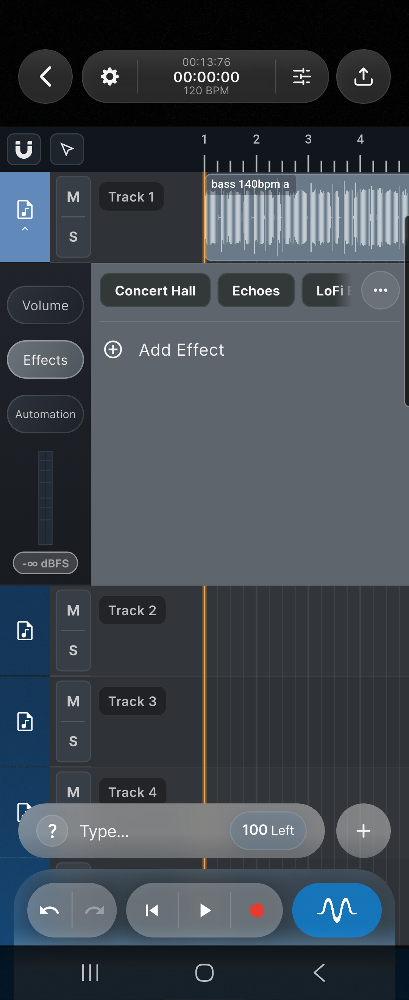

- add effect
- open effect parameters
- reorder effects
- bypass/unbypass effect
- delete effect
- copy effects
- paste effects
- clear effects
- apply presets

Built-in presets include:

- Concert Hall
- Echoes
- LoFi Effect

Applying a preset can replace the current row effects chain after confirmation.

### Built-In Effects

| Effect | Main Use |
| --- | --- |
| Gain | Utility level adjustment before or between other effects. |
| EQ 3-Band | Fast low, mid, and high tone shaping. |
| EQ Parametric | Precise frequency correction with filter bands, gain, frequency, and Q controls. |
| Compressor | Controls dynamics by reducing loud peaks and evening out level. |
| Limiter | Prevents peaks from exceeding a ceiling; useful near the end of a chain. |
| Clipper | Trims peaks more aggressively for loudness, punch, or controlled saturation. |
| De-Esser | Reduces harsh vocal sibilance such as "s" and "sh" sounds. |
| Distortion | Adds harmonic drive, grit, saturation, or heavier color. |
| Degrade | Lo-fi texture, bit/sample-rate style degradation, or damaged digital tone. |
| Delay | Timed echoes and repeats. |
| Reverb | Room, hall, plate, or space around a sound. |
| Pitch Shift | Raises or lowers pitch in semitones. |
| Chorus | Adds doubled, widened modulation. |
| Vibrato | Modulates pitch for movement or special effects. |
| Stereo | Basic stereo positioning or width control. |
| Stereo Pro | Advanced stereo width and imaging, with stereo scope support. |
| Volume Shaper | Rhythmic or drawn volume movement, such as pump or tremolo shapes. |
| Time Shaper | Rhythmic time-based shaping for gated or patterned movement. |

### Master Effects

Master Effects work like row effects but process the whole project output.

Use master effects for:

- final EQ
- compression
- limiting
- stereo shaping
- overall polish

Avoid using master effects to fix one problem track. Adjust the row or clip first when possible.

### Effect Parameters

Effect parameter pages may include:

- sliders
- switches
- choice menus
- EQ controls
- frequency/gain/Q tabs
- compressor or dynamics meters
- spectrum or analyzer views
- automation entry points

Long-pressing or using the Automate option on eligible parameters can create or reveal automation targets.

### Desktop Plugins

On supported desktop builds, Mixroom can scan and host external plugins. Plugin-related controls can include:

- scan/rescan plugins
- search plugins
- favorite plugins
- hide plugins
- add plugin folder
- open plugin UI
- copy/paste/clear effect chains

Availability depends on platform and plugin format support.

External plugin hosting is separate from Mixroom's built-in effects. Built-in effects are always addressed by their Mixroom effect name. External plugins depend on the installed plugin format and the platform's plugin support.

## 12. Master Bus

The master bus is the final processing stage before export.

It contains:

- master gain
- master pan
- master stereo meter
- row gain staging cards
- master effects
- global FX bypass

Use the master bus to monitor overall loudness and clipping. If the master meter is too hot, reduce row gains or master gain before adding more limiting.

### Master Bus Concept

Every row eventually flows into the master bus. The master bus controls the full project output, so changes here affect everything the listener hears.

Use row controls first when only one sound needs adjustment. Use the master bus when the whole project needs a final level, tone, width, compression, limiting, or export-ready polish.

### Gain Staging

Gain staging means keeping levels healthy at each step: clip, row, effects chain, and master.

Good gain staging prevents distortion and makes mixing easier:

- clip gain sets the level of an individual clip before row mixing
- row gain balances each track lane against the others
- effect input/output levels keep plugins from being overloaded
- master gain controls the final project level before export

If the master meter clips, lower row gains or loud clip gains before relying on a limiter. A limiter can catch peaks, but it should not be used to hide a badly balanced mix.

## 13. Automation

Automation lets users change a control over time. Instead of leaving volume, pan, or an effect parameter at one fixed value, users can draw or edit changes on the timeline.

Common uses:

- fade a row in or out
- lower a row during a vocal phrase
- create a filter sweep before a drop
- increase reverb only at the end of a line
- automate delay throws
- create rhythmic pumping with volume automation

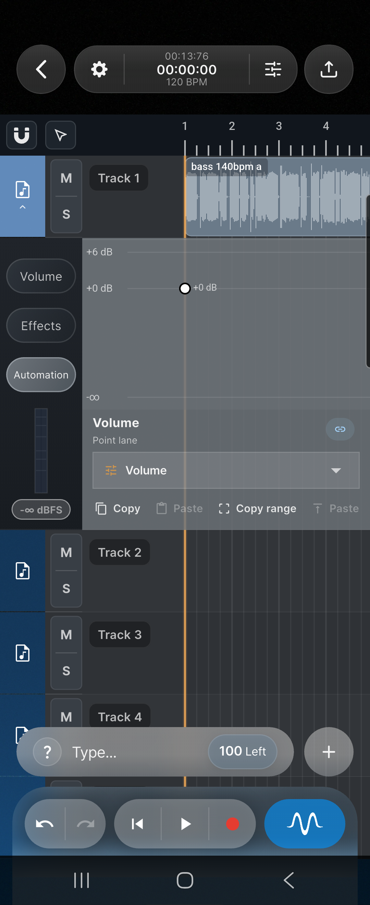

Automation can target:

- row volume
- row pan
- plugin parameters
- master gain
- master pan
- master effect parameters

### How Automation Works

Automation is built from points on a lane.

- Each point has a time position.
- Each point has a value.
- The line between points shows how the value changes over time.
- Playback follows the automation line while the project plays.

For example, two volume points can create a fade:

1. Add one point at the start of the fade with a low value.
2. Add another point later with a higher value.
3. During playback, Mixroom raises the volume between those two points.

Automation belongs to a target. Changing the target changes which control the lane is editing. A row can have volume automation, pan automation, and separate automation lanes for supported plugin parameters.

### Automation Tab

Expanded rows include an Automation tab. Users can:

- choose an automation target
- add automation points
- drag automation points
- copy all points
- paste points
- copy a selected time range
- paste a copied range at the playhead
- type an exact automation value
- match the previous point value
- delete points

Important controls:

| Control | Function |
| --- | --- |
| Target selector | Chooses what the lane edits, such as Volume, Pan, or an effect parameter. |
| Point lane | Shows automation points and the value curve. |
| Copy | Copies all points for the current target. |
| Paste | Pastes copied points into the current target. |
| Copy range | Copies only the selected time range, often the current loop range. |
| Paste range | Pastes a copied range at the playhead or target position. |
| Link/chain button | Jumps to the automated parameter. For plugin automation, Mixroom opens the plugin/effect panel and highlights the parameter so users can see exactly what the automation controls. |

Use row volume automation for arrangement moves. Use plugin automation when the sound itself needs to change, such as filter cutoff, reverb mix, delay feedback, or distortion drive.

### Automation Clips

Automation clips are reusable automation regions shown on the timeline.

Automation clip controls include:

- open parameter
- edit points
- clone
- make unique
- delete

Cloned automation clips can reuse the same pattern. Make Unique separates a clone so it can be edited independently.

Automation clips are useful when the same movement repeats. For example, a sidechain-style pump can be cloned across several bars. If one copy needs different timing or depth, use Make Unique before editing it.

### Automation Templates

The AI assistant can create common automation shapes, including:

- sidechain pump
- reverb tail
- filter sweep
- sidechain from kick

## 14. Sample Browser

The File Browser is used for browsing and inserting samples.

It supports:

- add sample folder
- root folder chips
- remove folder by long hold
- refresh folder
- expand/collapse panel
- close panel
- file browser help
- folder tree navigation
- unavailable folder recovery actions
- preview playback
- preview waveform/progress
- seek in preview
- visible duration
- insert at playhead
- drag files into the timeline

Unavailable folders can show actions such as:

- open settings
- pick folder
- retry
- remove folder

## 15. Audio Import

Audio can be imported through Add Audio Clip or the File Browser.

Mixroom prepares imported audio for editing by:

- checking media permissions when required
- copying or storing project audio assets
- converting audio where needed
- extracting waveform data
- placing the clip at the chosen row and time

Audio import behavior may vary by platform because Android, iOS, macOS, and Windows expose file access differently.

## 16. MIDI and Piano Roll

Instrument clips open in the piano roll.

Use Add Instrument Clip to create a MIDI/instrument clip. Open the clip to edit notes in the piano roll.

### Piano Roll Header

The piano roll includes:

- MIDI tab
- Instrument tab
- open external instrument UI, when available
- tools menu
- follow-playhead lock
- zoom out
- zoom in
- help
- fullscreen toggle
- close

### MIDI Editing

Users can:

- add notes on the grid
- tap an empty grid cell to place a note
- select notes
- box-select notes
- drag notes
- resize notes
- copy notes
- paste notes
- duplicate notes
- delete notes
- adjust selected-note velocity
- scale note lengths

Tap-to-add is the fastest mobile workflow: open a MIDI clip, choose the note row and beat position, then tap the grid. Drag horizontally to move timing, drag vertically to change pitch, and resize note edges to change duration.

### Piano Roll Tools

The tools menu includes:

- Select All
- Quantize All Notes
- Quantize Selected
- Chop All Notes
- Chop Selected
- Humanize Velocity
- Octave Up
- Octave Down

### Instrument Tab

The Instrument tab lets users choose and inspect instrument sounds.

It supports:

- category chips
- instrument list
- instrument badges
- instrument parameter controls
- Open UI for external plugin instruments, when supported

Instrument categories can include on-device instruments, keys, strings, woodwinds, percussion, pads, leads, bass, plucks, synths, brass, and drums.

## 17. Recording

Recording is started from the transport record button.

Before recording:

- select the target row
- confirm input permissions
- choose an input device
- choose an input channel when multiple channels are available
- enable metronome if needed

During recording, the record button becomes the stop control. When recording ends, Mixroom adds the captured audio to the project if usable data was recorded.

Bluetooth microphones and monitoring can have platform-specific behavior. Mixroom may disable real-time monitoring for Bluetooth output unless the advanced override is enabled.

### MIDI Recording

MIDI recording uses the selected instrument/MIDI target when live MIDI input is available.

Before MIDI recording:

- create or select an instrument clip
- choose the instrument sound
- select the MIDI-capable row or clip
- connect a MIDI input, or enable desktop keyboard MIDI input on supported desktop builds
- press Record

Recorded MIDI notes are added to the target clip and can be edited afterward in the piano roll.

## 18. Export

Export renders the project to a shareable audio file.

### Export Options

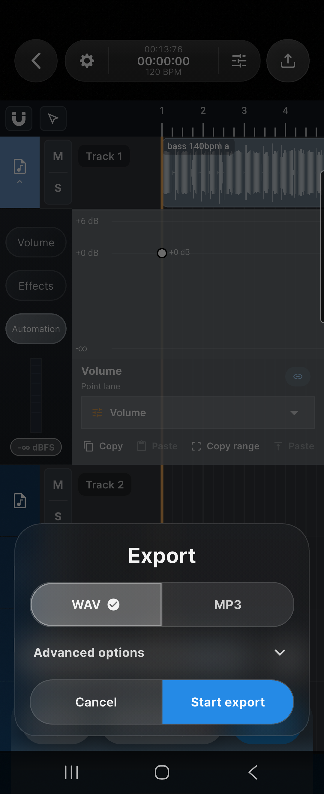

Export supports:

- WAV
- MP3, where available
- sample rate
- stereo or mono
- resample quality
- normalization
- normalization target
- WAV bit depth
- WAV dithering
- MP3 bitrate
- MP3 CBR/VBR mode
- MP3 VBR quality

On some desktop builds, export may be limited to native WAV rendering.

### Export Flow

1. Tap Export.
2. Choose format and options.
3. Tap Start export.
4. Wait for progress to complete.
5. Open the saved file or share it.

The export success screen can show:

- preview playback
- open saved file
- share
- return to DAW
- exit to projects

## 19. Project Saving and Recovery

Mixroom saves project state and assets so projects can be reopened later.

Saved project data includes:

- project name
- rows
- clips
- clip timing and settings
- MIDI notes
- automation
- row effects
- master effects
- project BPM/key
- relevant UI settings
- audio asset references

Project settings can show recovery notices if a project opened with missing files, missing plugins, or restored backup data.

## 20. Interactive Tutorial

The DAW includes an interactive tutorial that can highlight important controls.

Tutorial topics include:

- timeline navigation
- scrolling and zooming
- add button
- adding audio
- adding instruments
- row expansion
- row volume
- row effects
- adding effects
- opening effect parameters
- automation
- master bus
- chat bar
- sending AI prompts
- One-Button Mix
- export

The tutorial can be replayed from Project Settings.

## 21. AI Chat Overview

Mixroom includes a project-aware AI chat bar at the bottom of the DAW.

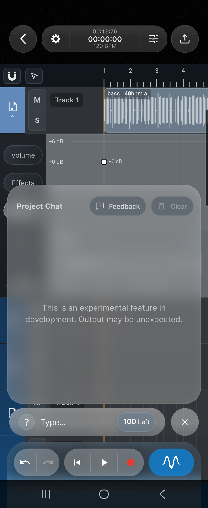

The AI chat can:

- answer DAW questions
- explain mixing concepts
- explain what it changed
- analyze the current project
- guide users to UI controls
- propose or execute mix actions
- run reference-track guided mix matching
- edit clips
- edit effects
- create automation
- create or modify MIDI
- insert samples
- run stem separation when available
- set or clear track role labels

The chat bar includes:

- help/capabilities button
- prompt input
- send button
- stop button while thinking
- prompt limit badge
- expanded chat history
- feedback button
- clear chat history button

### Prompt Limits

The prompt limit badge shows how many AI prompts the user has available in the current limit window.

Prompt limits can depend on:

- daily limits
- weekly limits
- subscription or entitlement state
- extra prompt banks
- whether an AI request is already running

If the user is out of prompts, Mixroom blocks new AI requests until more prompts are available. If a request is already running, the user can wait, stop it, or send another prompt after the current one finishes.

### What AI Chat Is Good For

Use AI chat when the user wants help deciding what to do, wants Mixroom to perform a supported action, or wants an explanation of a mix/editing concept.

Good uses:

- "Make the vocal clearer."
- "Why does this sound muddy?"
- "Use track 4 as a reference and make the rest of the mix closer."
- "Split the selected clip at the playhead."
- "Create a filter sweep into the drop."
- "Write a simple bassline."
- "How do I export?"

AI chat is not meant to replace listening. Users should review any AI change, especially gain, EQ, dynamics, automation, and master bus changes.

## 22. AI Chat Modes

### Informational Mode

Use this for questions and explanations.

Examples:

- "What does a compressor attack control do?"
- "Why does my vocal sound harsh?"
- "How do I export this project?"
- "Explain what changed in my mix."

Informational prompts do not edit the project.

### Mixing Mode

Use this for mix changes.

Examples:

- "Turn the vocals up a little."
- "Make the drums punchier."
- "Clean up the muddy low mids."
- "Add subtle reverb to the lead vocal."
- "Balance the whole song."
- "Put a limiter on the master."

Mixing actions can target:

- a row
- multiple rows
- the master bus
- the overall mix

Supported mix action families include:

- gain
- pan
- balance
- EQ
- compressor
- limiter
- clipper
- reverb
- delay
- distortion
- de-esser
- reference-track matching

Supported EQ-style descriptions include:

- muddy
- boxy
- boomy
- harsh
- bright
- thin
- dull
- sibilant
- warmth
- presence
- air
- low cut
- high cut

### Reference-Track Mixing

Reference-track mixing uses an existing row in the project as a sonic reference. The assistant compares the reference row against the target rows and can adjust the mix toward the reference.

Reference matching can work on:

- tone
- loudness
- stereo width
- glue/compression character
- broad full-mix feel

Example prompts:

- "Use track 6 as the reference and match the rest of the mix loosely."
- "Make my mix closer to the reference track, but do not change the reference."
- "Match the tone and width of the selected reference track."

The assistant does not edit the reference row itself. It uses that row as the comparison target and adjusts the other selected or relevant rows. If the reference row is unclear, Mixroom may ask for clarification or return a message that it could not find the reference.

### DAW Assistant Mode

Use this for editor actions.

Examples:

- "Show me where the export button is."
- "Split the selected clip at the playhead."
- "Move this clip one bar later."
- "Create a filter sweep into the drop."
- "Write a bassline for C-D-G-C."
- "Separate this clip into vocals and instrumental."
- "Set track 1 role to vocals."

## 23. AI-Supported Editor Actions

The AI action system currently covers these main families:

- informational help and tutorials
- project edits, including supported BPM/key-style project changes
- sample insertion and sample replacement
- clip editing and arrangement
- effect editing on rows and master bus
- automation editing and automation clips
- MIDI composition and MIDI editing
- audio-to-MIDI conversion when supported
- stem separation when supported
- role labels for tracks
- sonic mix changes, including reference-track guided mixing

### Tutorial and UI Guidance

The assistant can highlight or explain:

- chat bar
- toolbar
- play
- record
- restart
- mute
- solo
- export
- project settings
- plugins
- timeline
- piano roll
- row header
- row mute/solo
- row effects
- row volume
- row automation
- effect list
- add effect
- plugin parameters

### Clip Editing

The assistant can help with:

- trim
- auto-trim
- cut
- stretch
- move
- tempo follow
- auto BPM alignment
- detect tempo and set project BPM
- duplicate
- delete
- pitch shift
- cleanup of spoken clips
- removing a dialogue range
- tightening long pauses
- lifting quiet spoken phrases

### Effect Editing

The assistant can:

- add effects
- remove effects
- bypass effects
- unbypass effects
- toggle bypass
- work on row effects
- work on master effects

### Automation

The assistant can:

- set automation points
- add ramps
- clear automation
- create automation clips
- duplicate automation clips
- move automation clips
- delete automation clips
- mute or unmute automation clips
- set automation clip points
- make cloned automation clips unique
- apply automation templates

### MIDI

The assistant can:

- create a MIDI clip
- compose a bassline
- compose a pattern
- replace notes
- append notes
- chop notes
- transpose notes
- convert audio to MIDI when supported

### Samples and Stems

The assistant can:

- insert supported samples
- replace a target with a sample when available
- separate vocals and instrumental when stem separation is available

### Role Labels

The assistant can set or clear track roles such as:

- vocals
- drums
- bass
- guitar
- synth
- other

These roles help the assistant understand the project.

## 24. AI Safety, Confirmation, and Limits

AI actions are constrained to supported DAW operations. The assistant does not freely rewrite the project outside the available action system.

Some mix requests may be applied directly. Other requests may produce a proposal and ask the user to reply "yes" or "no" before applying.

The assistant may ask for clarification when the target is ambiguous, for example:

- "Trim the clip."
- "Automate the filter."
- "Move it right."

Prompt submission can be limited by:

- daily prompt limits
- weekly prompt limits
- extra prompt banks, when available
- a request already in progress

The stop button can interrupt an active chat flow.

## 25. What the AI Uses as Context

The AI chat is project-aware. It can use a structured summary of the project, including:

- recent chat history
- current user prompt
- BPM and project key
- row names and row status
- clip names and file names
- clip timing
- clip type: audio or MIDI
- track gain and pan
- selected row and selected clip information
- effect names
- automation targets
- lightweight audio analysis
- track role probabilities, such as vocals, drums, bass, guitar, synth
- overlap relationships between tracks
- pending proposed mix actions
- sample library summary when relevant

Current chat requests are designed around structured text context. Raw audio files, rendered stems, waveform buffers, full project files, full plugin state blobs, and complete automation point data are not sent through the normal cloud chat path.

## 26. AI Limitations

The AI is powerful, but it is not a replacement for user judgment.

Current limitations:

- It only supports the action families implemented in the DAW.
- It may ask for clarification when the target is unclear.
- It does not guarantee a professional final mix from one prompt.
- It does not generate a complete finished song from nothing.
- It does not generate new vocals or instruments from scratch in the normal DAW chat path.
- It does not send raw audio to the cloud chat path for direct audio understanding.
- It may depend on local engine support for stem separation, plugins, MIDI conversion, and export behavior.

Users should review AI changes, especially before exporting or sharing.

## 27. Practical AI Prompt Examples

### Mixing

- "Make the vocal clearer but not louder."
- "Reduce harshness on the guitar."
- "Tighten the low end."
- "Make the drums punchier."
- "Add a little air to the master."
- "Balance all active rows so the vocal stays in front."

### Editing

- "Split the selected clip at the playhead."
- "Move this clip one bar later."
- "Duplicate the selected clip."
- "Detect this loop's tempo and set the project BPM."
- "Reverse this audio clip."

### Automation

- "Create a sidechain pump on the pad."
- "Add a filter sweep into the drop."
- "Fade the reverb up at the end of this phrase."
- "Clear automation on this lane."

### MIDI

- "Write a simple bassline for C-D-G-C."
- "Chop these MIDI notes into 16ths."
- "Humanize the selected MIDI notes."
- "Transpose the selected notes up an octave."

### Help

- "Show me where to add plugins."
- "How do I use the piano roll?"
- "Where is the export button?"
- "Explain what a de-esser does."

## 28. Screenshot Coverage

Screenshots included in this draft:

| Screenshot | Purpose |
| --- | --- |
| Full DAW overview | Label the top toolbar, timeline, rows, chat, and transport. |
| Project settings | Show project name, input, output route, and crossfade options. |
| Tempo mode panel | Show BPM, key, and Off/Resample/Stretch project tempo mode. |
| Master bus | Show master gain, row gain staging, effects, and FX bypass. |
| Add menu | Show Add Audio Clip, Add Instrument Clip, and File Browser entry points. |
| Timeline clip selected | Show copy, paste/clone, clip settings, split, delete. |
| Row effects panel | Show presets, effect chain, bypass, delete, add effect. |
| Automation editor | Show target selector, points, copy/paste, automation clips. |
| AI chat | Show prompt input, prompt limits, send/stop, response history. |
| Export sheet | Show format, advanced options, and start export. |

Recommended remaining screenshots:

| Screenshot | Purpose |
| --- | --- |
| Piano roll | Show MIDI grid, tap-to-add note workflow, velocity, tools, and instrument tab. |
| Sample browser | Show folders, preview waveform, insert, and drag workflow. |
| Desktop plugin manager | Show plugin scan/rescan and external plugin management, if included in the target release. |

Use screenshots from the latest production-like build so labels and layout match what users see.

## 29. Quick Reference

| Area | Main Actions |
| --- | --- |
| Top toolbar | Back, settings, tempo/key, master bus, analyzer, export |
| Transport | Undo, redo, restart, play/pause, record/stop, One-Button Mix |
| Add menu | Add audio, add instrument, open file browser |
| Timeline tools | Select, stretch, paint, cut, delete, magnet snap, quantize grid |
| Row header | Select, expand, mute, solo, row menu, add row |
| Clip popover | Copy, clone, settings, split, delete |
| Clip settings | Rename, gain, normalize, pitch, tempo mode, reverse, detect tempo, split vocals |
| Tempo stretching | Project Tempo Mode plus per-clip Stretch/Resample setting |
| Loops | Create on ruler, drag handles, move loop region, restart from loop start |
| Row effects | Presets, add, reorder, bypass, delete, copy, paste, clear |
| Master bus | Master gain, master pan, level metering, master effects, FX bypass |
| Automation | Points, ramps, copy/paste, range copy, automation clips |
| Sample browser | Add folder, preview, seek, insert, drag to timeline |
| Piano roll | Notes, selection, quantize, chop, humanize, octave, instrument controls |
| AI chat | Help, analysis, mixing, DAW actions, automation, MIDI, stems |
| Export | WAV/MP3, sample rate, bit depth, normalization, share/open file |
