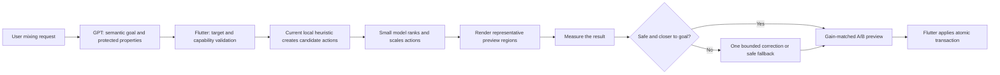

# MixRoom AI Mixing R&D

Date: 2026-09-28

## Finding

MixRoom already has a good base: the language model turns the user's request into a semantic mixing goal, Flutter resolves exact targets, a deterministic local model proposes gain/pan/effect actions, and the transaction layer validates, applies, verifies, and can roll back the edit.

The largest quality gap is that the system is currently **open loop**. It analyzes the project, chooses settings, and applies them once. It does not render the proposed mix, measure what those settings actually did, and make a bounded correction. The current n8n `/mixroom-jev-mix-resolve` route is also a compatibility pass-through: it returns the local heuristic actions unchanged, so it is not yet a learned mixing model.

The highest-value direction is a **constraint-aware, closed-loop mixing controller**. Keep the editable DAW controls and Flutter safety system. Add standards-calibrated analysis, a small learned action refiner, a short preview render, and one verification/correction pass.

## Why this direction

Research on automatic multitrack mixing repeatedly favors systems that predict normal console parameters rather than generate a finished waveform. The parameters remain understandable and editable, and the audio engine remains in control. Steinmetz et al. showed an arbitrary-track, permutation-invariant differentiable mixing console whose human-readable controls outperformed baseline approaches in an engineer listening test: <https://arxiv.org/abs/2010.10291>.

Diff-MST adds a reference song and predicts controllable audio-effect settings through a differentiable console: <https://arxiv.org/abs/2407.08889>. The newer Diff2Mix paper combines a generative controller with explicit effect parameters and reference control, but it is a very recent August 2026 result and should be treated as a later experiment rather than the first production design: <https://arxiv.org/abs/2608.05442>.

MixRoom's current architecture is already close to the safe, interpretable part of these systems. Replacing it with an end-to-end waveform generator would discard useful target validation, undo, and editable parameters.

## Recommended flow

The language model should own meaning: “make the vocal clearer but keep its level and pan.” It should return typed protected properties such as `gain`, `pan`, `timing`, `pitch`, `dynamics`, and `effects`. It should not invent exact EQ frequencies or compressor thresholds.

The mixing controller should own numeric decisions. Start with the existing heuristic actions, then let a small model decide whether each action is useful and scale its magnitude within hard bounds. It must not create arbitrary effect graphs. Low confidence, invalid output, or a worse measured preview should fall back to the known-safe heuristic.

The verification stage should render short representative sections, such as the densest region and loudest chorus, then compare before and after. Allow at most one correction pass to keep behavior and latency predictable.

## Specific improvements

1. **Use standards-calibrated measurements.** The present `true_peak_dbfs` is derived from the maximum sample and the LUFS value is documented as a coarse estimate. Add a tested ITU-R BS.1770 implementation for integrated/short-term loudness and inter-sample true peak. EBU R128 also defines Loudness Range and Maximum True Peak descriptors: <https://www.itu.int/rec/R-REC-BS.1770> and <https://tech.ebu.ch/publications/r128>. Do not force the broadcast target of -23 LUFS on music; export targets should be selectable.

2. **Measure cross-track interaction.** Add pairwise masking features for important roles, especially vocal/instrumental, kick/bass, and lead/accompaniment. Calculate them in the same time window instead of judging each track only in isolation.

3. **Add post-render verification.** Detect overshoot, clipping, excessive stereo width, phase problems, and cases where the requested goal did not improve. This is likely to improve quality more reliably than changing the planner model.

4. **Activate a real magnitude refiner.** MixRoom already has the contract, model flags, ONNX support, debug fields, and producer capture. Replace the n8n pass-through with a versioned model that returns bounded action scales/deltas and confidence. Prefer local ONNX inference for normal use; n8n can route model versions, record evaluation metadata, and provide controlled fallback.

5. **Make preservation constraints machine-readable.** Carry protected properties from planning through materialization and reject any action that changes them. This prevents requests such as “make it wider but keep level unchanged” from accidentally changing gain.

6. **Offer a gain-matched A/B preview and one Amount control.** Matching loudness reduces the common bias toward the louder version. The Amount control can safely scale the complete action set and gives the user fast control without exposing every technical parameter.

7. **Learn from real outcomes.** Use the existing opt-in producer capture to record accepted plans, undo, redo, and the user's immediate manual corrections. Train on feature/action/outcome data first; raw audio upload is not required. Split evaluation by project/song so the model cannot memorize the same song in train and test.

8. **Add reference mixing later.** A reference track can guide spectral balance, stereo width, dynamics, and ambience while the controller still emits editable parameters. Gain-match the reference before comparison. Review dataset and implementation licenses before commercial use; common multitrack research datasets often have non-commercial restrictions.

## Development phases

### Phase 0 — trusted measurement and baseline

- Replace coarse loudness/peak measurements with verified BS.1770 measurements.
- Build fixed test projects across genres, track counts, dense mixes, sparse mixes, and bad recordings.
- Record the present heuristic output, latency, undo rate, and user adjustments as the baseline.
- Add before/after metrics and model version to the existing observability trace.

### Phase 1 — closed-loop deterministic prototype

- Render two or three short representative regions after proposing actions.
- Re-analyze the preview and perform one bounded deterministic correction.
- Reject clipping, phase failure, target violations, and protected-property changes.
- Add gain-matched A/B preview and Amount control.

This phase does not need a new ML model and gives clean training/evaluation data.

### Phase 2 — learned action ranker/refiner

- Train an `apply/skip` classifier and bounded magnitude/delta regressor using the current feature contract plus target role, current effect state, goal, and proposed action.
- Run it in shadow mode first: log its answer without changing the mix.
- Compare it with the heuristic on identical projects.
- Move to opt-in producer testing only after the safety suite passes.

### Phase 3 — reference mix controller

- Add user-supplied reference analysis and style embeddings.
- Predict editable gain, pan, EQ, compression, ambience, and master-bus parameters.
- Keep the same render-measure-correct safety loop.

## Evaluation

Automatic scores alone cannot tell whether a mix sounds good. Use both deterministic tests and blinded listening.

The hard safety suite should require correct targets, no protected-property violations, valid effect ranges, no unintended effect insertion, no unacceptable true-peak or phase regression, correct undo/rollback, and deterministic fallback on timeout or model failure.

For quality, compare the current heuristic and each candidate using the exact same projects and loudness-matched playback. Measure preference, request success, undo rate, the size of the user's later manual correction, time to an acceptable result, and latency. Use hidden songs/projects for final evaluation. For formal listening tests, ITU-R BS.1534 provides the MUSHRA method: <https://www.itu.int/rec/R-REC-BS.1534>.

## Recommended first implementation

Build Phase 0 and Phase 1 before training or integrating another large model. This converts MixRoom from “choose settings once” to “choose, hear, verify, and correct,” while keeping every change editable and reversible. After that baseline is working, the existing magnitude predictor and producer-capture infrastructure make the small learned refiner a contained next step.

## Pause checkpoint — 2026-09-30

### Repository state

- Local branch: `ai-v4`.
- Base before this checkpoint: `952e223e` (`origin/main` as last fetched).
- This is research/prototype work only. Neither exported n8n workflow is active.
- The two workflow exports are `mixroom-unified-planner.json` and `mixroom-jev-hybrid.json`.
- The drafted mixing modules are `mixing/features.js`, `mixing/inference.js`, and `mixing/state.js`.

### What is implemented

- One-Button Mix uses the V3 planner when it is available and keeps the legacy route as a fallback when it is not.
- A One-Button Mix starts as a fresh request instead of modifying a pending chat preview.
- The selected Producer, Warm & Spacious, or Punchy & Energetic profile is carried through deferred materialization and tunes the resolved actions before the existing safety checks run.
- Debug builds can attach a locally configured n8n header to planner and magnitude requests. No secret value is stored in tracked files.
- The unconditional One-Button Mix success snackbars were removed so a failed or no-op run is not reported as successful by the caller.
- The Jev hybrid experiment has a deliberately narrow command fast-path and falls back to the full planner for ambiguous, compound, unsupported, or low-confidence input.
- The magnitude-refiner prototype defines 77 inputs: 62 context features and 15 per-action features. It includes bounded inference, validation, fallback, shadow, and allowlisted candidate modes.

### What is not implemented

- The three mixing modules are not wired into either n8n workflow export.
- The current n8n mixing compatibility route still validates the request and returns the local heuristic actions unchanged.
- There is no render, measure, and bounded correction loop yet.
- Header forwarding needs dedicated HTTP tests and endpoint scoping before it is safe beyond local R&D.
- No production workflow has been activated and no production rollout is approved.

### Verification at pause

- Focused Flutter suite: 111 tests passed across `ai_v3_config_test.dart`, `ai_v3_mix_materializer_test.dart`, and `assistant_action_flow_test.dart`.
- The workflow JSON exports parse successfully.
- The three mixing JavaScript modules pass `node --check`.
- Manual macOS audio and n8n end-to-end testing is still required.

### Local-only settings and private evidence

`tool/local_ai_debug.json` is ignored and must never be committed. Its current setting names are listed here so the setup can be recreated without recording values:

- `AI_V3_LONG_PATH_ENABLED`
- `AI_V3_PRIMARY_ENABLED`
- `AI_V3_PROXY_PATH`
- `AI_V3_REQUEST_TIMEOUT_SECONDS`
- `LLM_DISABLE_PROXY_IN_DEBUG`
- `LLM_PROXY_API_BASE_URL`
- `LLM_PROXY_MIX_RESOLVE_PATH`
- `MIXROOM_AI_DEBUG`
- `MIXROOM_AI_DEBUG_VERBOSE`
- `MIXROOM_LOCAL_REFINE_URL`
- `MIXROOM_N8N_SECRET`
- `MIXROOM_N8N_SECRET_HEADER`

The workflow exports contain credential references only. Reconnect credentials after importing; never copy credential values into this document or Git.

`tool/ai_v3_captures.local/` contains three private captures from 2026-08-16. They include request, project, conversation, provider, and execution data. Keep them in private encrypted storage and do not commit or share them.

### Important safety notes

- Never provide the n8n secret defines to profile or release builds. A compile-time client secret can be extracted from an app binary even if the release path does not send it.
- Before continuing, prevent custom headers from overriding `Authorization` or `Content-Type` and send the n8n secret only to the intended local/R&D endpoint.
- Preserve the compatibility pass-through as the deterministic fallback.
- Keep both workflows inactive until shadow-mode tests and observability checks pass.

### First steps when resuming

1. Duplicate the inactive compatibility workflow and wire in `features.js`, `inference.js`, and `state.js`.
2. Add parity tests plus invalid-input, timeout, reserved-header, endpoint-scope, and fallback tests.
3. Run shadow mode only on allowlisted test projects and inspect the observability output without changing any mix.
4. Run all three One-Button Mix profiles on macOS and confirm each action applies once, pending chat previews are ignored, and failure/no-op paths show no false success message.
5. Only after the shadow results are safe, consider the allowlisted candidate mode. Build the closed-loop render/measure/correct prototype before any wider rollout.
